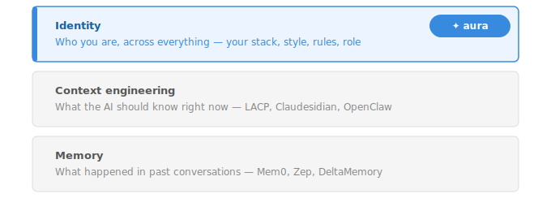
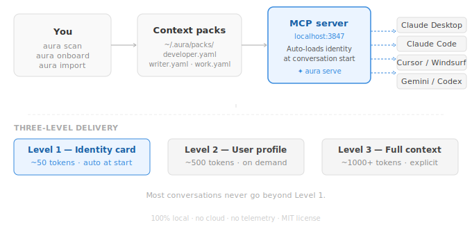

<p align="center">
  <br />
  <strong><code>✦ aura-ctx</code></strong>
  <br />
  <em>Stop re-explaining yourself to every AI tool.</em>
  <br /><br />
  <a href="https://pypi.org/project/aura-ctx/"></a>
  <a href="https://pepy.tech/projects/aura-ctx"></a>
  <a href="https://github.com/WozGeek/aura-ctx/blob/main/LICENSE"></a>
  <a href="https://pypi.org/project/aura-ctx/"></a>
  <a href="https://github.com/WozGeek/aura-ctx/stargazers"></a>
</p>

<p align="center">
  <a href="https://wozgeek.github.io/aura-ctx">Website</a> ·
  <a href="#quick-start">Quick Start</a> ·
  <a href="#how-it-works">How It Works</a> ·
  <a href="#supported-tools">Supported Tools</a> ·
  <a href="#commands">Commands</a> ·
  <a href="#security">Security</a>
</p>

---

Define who you are — your stack, your style, your rules — **once**, in plain
YAML files you own. aura serves that identity to Claude, ChatGPT, Cursor, and
Gemini through the [Model Context Protocol](https://modelcontextprotocol.io).
100% local. No cloud. No lock-in.

## The problem



Every AI tool starts from scratch. Claude doesn't know what ChatGPT learned.
Cursor doesn't know your coding style. Gemini has no idea what stack you use.

You re-explain yourself dozens of times a day — your role, your rules, your
preferences. Every new conversation. Every new tool. Every new session.

The industry is building solutions for this, but at the wrong layer:

| Layer                   | What it solves                      | Examples                     |
| ----------------------- | ----------------------------------- | ---------------------------- |
| **Memory**              | What happened in past conversations | Mem0, Zep, DeltaMemory       |
| **Context engineering** | What the AI should know right now   | LACP, Claudesidian, OpenClaw |
| **Identity**            | Who you are, across everything      | **aura**                     |

Memory is session history. Context is prompt engineering. **Identity is who you
are** — your stack, your style, your rules, your role — structured, portable,
and owned by you.

**aura is the identity layer.**

## Who this is for

**You use multiple AI tools daily** — Claude for thinking, Cursor for coding,
ChatGPT for drafting, Gemini for research. You're tired of re-explaining your
stack and style to each one.

**You're a developer who values control** — you want your context in plain text
files you can read, edit, and version-control. Not locked inside a platform.

**You're building with AI, not just using it** — you care about token
efficiency, MCP, and how your tools talk to each other.

If you've ever pasted your coding style into a system prompt and wished it could
just follow you everywhere — that's what aura does.

---

## Quick Start

```bash
pip install -U aura-ctx
aura quickstart
```

What happens in 30 seconds:

```
✦ aura quickstart

Step 1/5 — Scanning your machine...
  ✦ Detected 12 facts about your dev environment

Step 2/5 — Quick questions about you...
  What's your role? → Full-stack dev
  How do you want AI to talk to you? → Direct, no fluff
  What are you working on? → shipping v2 of our dashboard
  Any rules or pet peeves? → No corporate jargon, always TypeScript
  What human languages? → English and French
  ✦ Created developer (8 facts, 4 rules)
  ✦ Created writer (2 facts, 3 rules)
  ✦ Created work (2 facts, 0 rules)

Step 3/5 — Configuring AI tools...
  ✦ Claude Desktop configured
  ✦ Cursor configured

Step 4/5 — Security audit...
  ✦ All clean — no secrets detected

Step 5/5 — Starting MCP server...
  ✦ http://localhost:3847/mcp
  Restart your AI tools — they know you now.
```

No Docker. No database. No cloud account.

## See it work

**Before aura:**

```
You:    What do you know about me?
Claude: I don't have any information about you.
        Memory is turned off for your account.
```

**After `aura quickstart`:**

```
You:    What do you know about me?
Claude: Here's what I know from your aura context:

        Role: CS student
        Editor: Cursor
        Stack: TypeScript, Python, React, FastAPI, Tailwind
        Projects: aura, kipedia, hotepia
        Style: Technical, precise, no hand-holding
        Rules: Always use TypeScript strict mode, no 'any'
```

Same question. Completely different answer.

> **Note on auto-loading:** On MCP-native desktop clients (Claude Desktop,
> Cursor, Windsurf), aura loads your identity automatically at conversation
> start. On web interfaces (claude.ai, ChatGPT web), ask once per session:
> _"Check my aura context before responding."_

---

## How It Works



```
You
 │
 ├── aura scan       Detects languages, frameworks, tools, projects
 ├── aura onboard    5 questions → writing style, role, rules
 ├── aura import     Pulls context from ChatGPT & Claude exports
 │
 ▼
Context Packs (YAML)    ~/.aura/packs/developer.yaml
 │                      ~/.aura/packs/writer.yaml
 │                      ~/.aura/packs/work.yaml
 │
 ▼
MCP Server              localhost:3847
 │
 ├──▶ Claude Desktop    (auto-configured)
 ├──▶ Claude Code       (auto-configured)
 ├──▶ Cursor IDE        (auto-configured)
 ├──▶ Windsurf IDE      (auto-configured)
 ├──▶ VS Code           (auto-configured)
 ├──▶ ChatGPT Desktop   (SSE, manual)
 ├──▶ Gemini CLI        (auto-configured)
 └──▶ Codex CLI         (auto-configured)
```

> **What's MCP?** The [Model Context Protocol](https://modelcontextprotocol.io)
> is an open standard that lets AI tools connect to local data sources. aura
> uses it so Claude, Cursor, and others can read your context without any custom
> integration.

### Context Packs

Your identity lives in scoped YAML files. Each pack covers a domain —
development, writing, work, or anything custom. Human-readable. Git-friendly.
They never leave your machine unless you choose otherwise.

```yaml
# ~/.aura/packs/developer.yaml
name: developer
scope: development

facts:
  - key: languages.primary
    value: [TypeScript, Python]
    type: skill
    confidence: high
  - key: editor
    value: Cursor
    type: preference
  - key: frameworks
    value: [Next.js, FastAPI, Tailwind, Supabase]
    type: skill
  - key: style.code
    value: "Explicit types, functional patterns, minimal comments"
    type: style

rules:
  - instruction: Always use TypeScript strict mode — no 'any'
    priority: 9
  - instruction: Dark theme by default, CSS variables for all colors
    priority: 8
  - instruction: Error handling with specific types, not generic catches
    priority: 7
```

Every pack is validated against
[`context-pack.schema.json`](context-pack.schema.json) on load.

### Smart Fact Delivery

aura learns which facts your AI tools actually use and surfaces them first.

**Priority scoring** — every fact is scored on every MCP response:

```
score = (usage_frequency × 0.4) + (freshness × 0.4) + (confidence × 0.2)
```

Facts your tools request often float to the top automatically.

**Three-level token delivery** — context windows are finite:

| Level | MCP Tool            | Tokens   | When                              |
| ----- | ------------------- | -------- | --------------------------------- |
| 1     | `get_identity_card` | ~50–100  | Auto-called at conversation start |
| 2     | `get_user_profile`  | ~200–500 | When the AI needs more detail     |
| 3     | `get_all_context`   | ~1000+   | Only when explicitly asked        |

Most conversations never load beyond level 1.

---

## Supported Tools

| Tool                | Setup                        | Transport       |
| ------------------- | ---------------------------- | --------------- |
| **Claude Desktop**  | `aura setup` — auto          | Streamable HTTP |
| **Claude Code**     | `aura setup` — auto          | Streamable HTTP |
| **Cursor IDE**      | `aura setup` — auto          | Streamable HTTP |
| **Windsurf IDE**    | `aura setup` — auto          | Streamable HTTP |
| **VS Code**         | `aura setup` — auto          | Copilot MCP     |
| **Gemini CLI**      | `aura setup` — auto          | SSE             |
| **Codex CLI**       | `aura setup` — auto          | Streamable HTTP |
| **ChatGPT Desktop** | Developer Mode → add SSE URL | SSE             |
| **Any MCP client**  | Point to `localhost:3847`    | HTTP or SSE     |

```bash
aura setup   # auto-configures all detected tools
aura serve   # starts MCP server on localhost:3847
```

<details>
<summary><strong>Claude Desktop — manual config</strong></summary>

```json
{
  "mcpServers": {
    "aura": { "url": "http://localhost:3847/mcp" }
  }
}
```

</details>

<details>
<summary><strong>Cursor / Windsurf / VS Code — manual config</strong></summary>

```json
{
  "mcpServers": {
    "aura": { "url": "http://localhost:3847/mcp" }
  }
}
```

</details>

<details>
<summary><strong>ChatGPT Desktop — manual config</strong></summary>

Settings → Connectors → Advanced → Developer Mode:

```
SSE URL: http://localhost:3847/sse
```

</details>

<details>
<summary><strong>Gemini CLI — manual config</strong></summary>

```json
{
  "mcpServers": {
    "aura": { "uri": "http://localhost:3847/sse" }
  }
}
```

</details>

---

## Commands

### Getting started

| Command                 | What it does                                               |
| ----------------------- | ---------------------------------------------------------- |
| `aura quickstart`       | Full setup: scan → onboard → configure → audit → serve     |
| `aura scan`             | Auto-detect your stack from tools, repos, and config files |
| `aura onboard`          | 5 questions to generate your context packs                 |
| `aura setup`            | Auto-configure all detected AI tools                       |
| `aura install`          | Alias for `aura setup`                                     |
| `aura serve`            | Start the MCP server on `localhost:3847`                   |
| `aura serve --watch`    | Start with hot-reload on YAML changes                      |
| `aura serve --no-track` | Start without recording usage stats                        |
| `aura update`           | Update aura to the latest version                          |
| `aura version`          | Show current version + check for updates                   |

### Managing packs

| Command                         | What it does                    |
| ------------------------------- | ------------------------------- |
| `aura list`                     | List all context packs          |
| `aura show <pack>`              | Display a pack's full contents  |
| `aura add <pack> <key> <value>` | Add a fact without opening YAML |
| `aura edit <pack>`              | Open a pack in `$EDITOR`        |
| `aura create <n>`               | Create a new empty pack         |
| `aura create <n> -t <template>` | Create from a built-in template |
| `aura templates`                | List all 14 available templates |
| `aura delete <pack>`            | Delete a pack                   |
| `aura diff <a> <b>`             | Compare two packs side by side  |

### Schema & validation

| Command                            | What it does                                    |
| ---------------------------------- | ----------------------------------------------- |
| `aura schema`                      | Print the JSON Schema spec for context packs    |
| `aura schema --output schema.json` | Export schema to a file                         |
| `aura validate <pack>`             | Validate a pack — field-level errors if invalid |

### Analytics

| Command                 | What it does                            |
| ----------------------- | --------------------------------------- |
| `aura stats`            | Show which facts your AI tools use most |
| `aura stats --pack <n>` | Filter by pack                          |
| `aura stats --reset`    | Clear all usage counters                |

Usage data is stored locally at `~/.aura/usage.json`. Nothing leaves your
machine. Opt out permanently with `track_usage: false` in `~/.aura/config.yaml`,
or per-session with `aura serve --no-track`.

### Permissions

| Command                                | What it does                               |
| -------------------------------------- | ------------------------------------------ |
| `aura permissions list`                | Show current per-agent permissions         |
| `aura permissions set <agent> <packs>` | Restrict an agent to specific packs        |
| `aura permissions set <agent> all`     | Grant an agent access to all packs         |
| `aura permissions reset`               | Restore default (all agents see all packs) |

```bash
aura permissions set claude developer,writer,work
aura permissions set cursor developer
aura permissions set chatgpt writer,work
aura permissions reset
```

Agent identity is detected automatically from the `User-Agent` or `X-Agent-Id`
header. Recognized: `claude`, `cursor`, `chatgpt`, `gemini`, `copilot`,
`windsurf`, `codex`. Unknown agents fall back to `default: all`.

### Health & maintenance

| Command            | What it does                                                |
| ------------------ | ----------------------------------------------------------- |
| `aura doctor`      | Check pack health — bloat, stale facts, duplicates, secrets |
| `aura audit`       | Scan packs for leaked API keys, tokens, credentials         |
| `aura audit --fix` | Auto-redact critical secrets                                |
| `aura consolidate` | Merge duplicate facts, surface contradictions               |
| `aura decay`       | Remove expired facts based on type-aware TTL                |

### Templates

14 built-in templates. Each includes typed facts and AI interaction rules
tailored to the profile.

**Stack-specific** — `frontend` · `backend` · `data-scientist` · `mobile` ·
`devops` · `ai-builder`

**Role-specific** — `founder` · `student` · `marketer` · `designer`

**General-purpose** — `developer` · `writer` · `researcher` · `work`

```bash
aura templates                          # list all templates
aura create mydev -t frontend           # frontend dev pack
aura create ds -t data-scientist        # data science pack
aura create study -t student            # student pack
```

### Import & export

| Command                               | What it does                                   |
| ------------------------------------- | ---------------------------------------------- |
| `aura import -s chatgpt <file>`       | Import from a ChatGPT data export              |
| `aura import -s claude <file>`        | Import from a Claude data export               |
| `aura extract <file>`                 | Extract facts from conversations via local LLM |
| `aura export <pack> -f system-prompt` | Universal LLM system prompt                    |
| `aura export <pack> -f cursorrules`   | `.cursorrules` file for Cursor                 |
| `aura export <pack> -f chatgpt`       | ChatGPT custom instructions                    |
| `aura export <pack> -f claude`        | Claude memory statements                       |
| `aura export <pack> -f claude-md`     | `CLAUDE.md` section (Claude Code, gstack)      |
| `aura export <pack> -f agents-md`     | `AGENTS.md` section (Codex, OpenClaw)          |

---

## Security

aura was built privacy-first from the ground up. Your context never leaves your
machine.

```bash
aura serve                              # localhost only, no auth
aura serve --token my-secret            # require Bearer token
aura serve --packs developer,writer     # expose only specific packs
aura serve --read-only                  # prevent writes via MCP
aura serve --watch                      # hot-reload on changes
```

**Secret detection** — `aura audit` scans every fact and rule for leaked
credentials before they reach an LLM. Catches 30+ patterns: AWS keys, GitHub
tokens, OpenAI/Anthropic API keys, Slack tokens, database URLs, private keys,
and more. The MCP server scrubs critical secrets automatically at serve time —
even if you skip the audit.

| Control           | What it does                                                |
| ----------------- | ----------------------------------------------------------- |
| Localhost binding | Binds to `127.0.0.1` only — not reachable from the network  |
| Bearer token auth | Optional `--token` flag or `AURA_TOKEN` env var             |
| Scoped serving    | Choose which packs each tool can access                     |
| Read-only mode    | AI tools read your context — they can never write to it     |
| No telemetry      | No analytics, no crash reports, no usage tracking. Nothing. |

---

## Architecture

aura is a lean Python CLI with no heavy dependencies. No database. No Docker. No
daemon.

```
aura/
├── cli.py            # 27 commands (Typer + Rich)
├── schema.py         # ContextPack, Fact, Rule (Pydantic)
├── schema_export.py  # JSON Schema generator + pack validator
├── mcp_server.py     # FastAPI MCP server (HTTP + SSE)
├── scanner.py        # Machine scanner with incremental SHA-256 hashing
├── onboard.py        # Interactive onboarding
├── pack.py           # Pack CRUD + templates + schema validation on load
├── usage.py          # Local MCP usage tracker + priority scoring
├── permissions.py    # Per-agent pack visibility
├── audit.py          # Secret detection engine (30+ patterns)
├── freshness.py      # Staleness scoring (0–100 per fact)
├── version_check.py  # PyPI update checker with daily cache
├── scan_cache.py     # SHA-256 content hashing for fast re-scans
├── watcher.py        # File watcher for hot-reload
├── doctor.py         # Pack health checker
├── consolidate.py    # Dedup + contradiction detection
├── extractor.py      # LLM-based fact extraction (Ollama / OpenAI)
├── diff.py           # Pack diffing
├── setup.py          # Auto-config for 8 AI tools
├── exporters/        # system-prompt, cursorrules, chatgpt, claude, claude-md, agents-md
└── importers/        # ChatGPT + Claude data importers
```

9,200+ lines of Python · 368 tests · 27 commands · 14 templates · MIT license

---

## Roadmap

### Shipped

- [x] Machine scanner — languages, frameworks, tools, projects, git identity
- [x] Context packs — typed facts, confidence levels, scopes, sources
- [x] MCP server — resources, tools, prompt templates (HTTP + SSE)
- [x] Auto-config for 8 AI tools (Claude Desktop, Claude Code, Cursor, Windsurf,
      VS Code, Gemini CLI, Codex, ChatGPT)
- [x] Token auth, scoped serving, read-only mode
- [x] Import from ChatGPT + Claude data exports
- [x] LLM-based fact extraction (Ollama, OpenAI)
- [x] Pack health checker + consolidation engine
- [x] Memory decay with type-aware TTL
- [x] Secret detection and auto-redaction (30+ patterns)
- [x] Incremental scan with SHA-256 content hashing
- [x] File watcher (`aura serve --watch`)
- [x] Three-level token delivery (~50 / ~500 / ~1000+ tokens)
- [x] 14 built-in templates
- [x] CLAUDE.md / AGENTS.md exporters
- [x] Freshness scoring — per-fact and per-pack (0–100)
- [x] Self-update (`aura update`) with daily version check
- [x] JSON Schema spec (`context-pack.schema.json`, `aura schema`,
      `aura validate`)
- [x] Usage-based fact priority — sorted by access frequency + freshness +
      confidence
- [x] Local usage analytics (`aura stats`) — opt-in, zero cloud
- [x] Per-agent permissions (`aura permissions`) — control what each tool can
      see
- [x] Auto-consultation via MCP — prompt template, resource subscription, setup
      injection

### Next

- [ ] Import from Obsidian vaults and Markdown files
- [ ] Skills — activatable behavior modules
- [ ] Chrome extension — capture context from browser AI conversations
- [ ] Share via GitHub Gist
- [ ] Cloud sync (opt-in, end-to-end encrypted)
- [ ] Team sharing

---

## Contributing

```bash
git clone https://github.com/WozGeek/aura-ctx.git
cd aura-ctx
pip install -e ".[dev]"
pytest
```

Good first issues:

- **New export format** — add Windsurf or Continue.dev support
  ([guide](CONTRIBUTING.md#adding-an-exporter))
- **New importer** — Obsidian vault or Markdown parsing
- **Pack templates** — domain-specific starter packs
- **Translations** — French, Spanish, Portuguese, Chinese

See [CONTRIBUTING.md](CONTRIBUTING.md) for the full guide.

---

## License

[MIT](LICENSE) — © Enoch Afanwoubo
